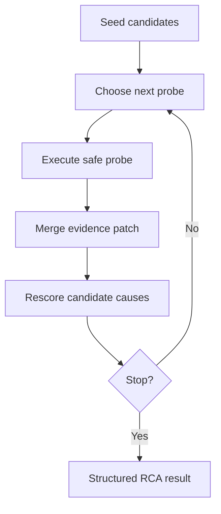

# RCA Overall Architecture

## 1. Overview

当前这套 RCA 不是让 LLM 直接“猜根因”，而是一个 **路由 -> 图取证 -> 调查 -> 打分 -> 结构化输出 -> 前端展示** 的完整链路。

它的目标是解决两个问题：

- 不只回答“谁风险高”，还要回答“为什么这次异常发生”
- 不只给结论，还要给出 **事件链、支撑节点、支撑关系、溯源记录**

核心思想是：

1. 先把问题识别成 RCA 场景
2. 先从 Neo4j 收集确定性证据
3. 再进入受控调查循环，逐步补证据
4. 最后按“直接事件证据优先、结构暴露次之”进行根因排序

---

## 2. End-to-End Flow

```mermaid
flowchart LR
    A["User Question"] --> B["/api/chat or /api/chat/stream"]
    B --> C["GraphRAGAgentExecutor.invoke()"]
    C --> D["RCA Router classify_intent()"]
    D --> E["Build RCAAnomaly"]
    E --> F["collect_seed_evidence()"]
    F --> G["score_causes() seed round"]
    G --> H["run_investigation()"]
    H --> I["Select safe probe"]
    I --> J["run_probe() on Neo4j"]
    J --> K["Merge evidence"]
    K --> L["score_causes() again"]
    L --> M["Build structured RCA result"]
    M --> N["render_report()"]
    M --> O["/api/graph_view RCA Evidence"]
    O --> P["Frontend RCA Panel + Why This Cause"]
```



---

## 3. Main Modules

### 3.1 Entry Layer

- `supplychain_agent.py`
  - `GraphRAGAgentExecutor.invoke()`
  - 负责把普通问答和 RCA 问题分流

- `graphrag_api.py`
  - `/api/chat`
  - `/api/chat/stream`
  - `/api/rca`
  - `/api/graph_view`

### 3.2 Intent Routing Layer

- `rca/router.py`
  - `classify_intent(question, history_text)`

当前支持 4 类 RCA：

- `order_delay`
- `supplier_risk`
- `carrier_delay`
- `product_impact`

这一层负责：

- 判断是不是 RCA 问题
- 抽取目标对象
- 确定 `target_type / target_id`

### 3.3 RCA Engine Layer

- `rca/engine.py`
  - `RCAEngine.run()`
  - `_build_structured_result()`
  - `_augment_graph_with_rca_layers()`

这一层负责：

- 组织整个 RCA 执行流程
- 汇总 evidence / causes / actions
- 生成结构化 RCA 结果
- 给图谱叠加 RCA 虚拟分析层

### 3.4 Evidence Collection Layer

- `rca/collectors.py`
  - `collect_seed_evidence()`
  - `run_probe()`
  - `_collect_local_evidence_graph()`

这一层负责：

- 对目标对象做第一轮确定性取证
- 构建局部证据子图
- 在调查阶段执行安全 probe

### 3.5 Investigation Layer

- `rca/investigator.py`
  - `_PROBE_CATALOG`
  - `_CAUSE_PROBE_PRIORITY`
  - `_plan_probe_with_llm()`
  - `run_investigation()`

这一层负责：

- 决定下一步查什么
- 控制 probe 执行顺序
- 维护 investigation steps
- 判断什么时候停止调查

### 3.6 Scoring Layer

- `rca/scorers.py`
  - `_score_order_delay()`
  - `_score_supplier_risk()`
  - `_score_carrier_delay()`
  - `_score_product_impact()`
  - `score_causes()`

这一层负责：

- 根因候选排序
- 组合直接证据和结构证据
- 输出 `candidate_causes`

### 3.7 Presentation Layer

- `rca/renderer.py`
  - `render_report()`

- `index.html`
  - `renderRcaPanel()`
  - `renderCauseList()`
  - `renderCauseDetail()`

这一层负责：

- 自然语言报告生成
- RCA 面板展示
- `Why This Cause` 展示

---

## 4. RCA Data Model

### 4.1 Structural Graph

原始供应链图主要包含：

- `Customer`
- `Order`
- `Product`
- `Category`
- `Department`
- `Supplier`
- `Component`
- `Carrier`

主要关系包括：

- `PLACED_ORDER`
- `CONTAINS_PRODUCT`
- `SUPPLIES_COMPONENT`
- `USED_IN`
- `SHIPPED_BY`

这部分更适合回答：

- 谁影响谁
- 影响范围有多大
- 哪些依赖最集中

### 4.2 Event Layer

为了让 RCA 更像真正的根因分析，新增了事件层：

- `SupplierNotice`
- `QualityInspection`
- `DelayEvent`
- `SourceRecord`

事件层解决的是：

- 异常是怎么发生的
- 是哪个行为或事件触发了传播
- 证据来自哪条记录

典型事件链：

```text
SupplierNotice -> QualityInspection -> DelayEvent -> Order
```

典型支撑关系：

- `Supplier-ISSUED_NOTICE->SupplierNotice`
- `Supplier-UNDERWENT_INSPECTION->QualityInspection`
- `Order-HAS_DELAY_EVENT->DelayEvent`
- `DelayEvent-SUPPORTED_BY->SourceRecord`

---

## 5. Seed Evidence Phase

Seed phase 是 RCA 的第一轮证据收集。

输入：

- `RCAAnomaly`

输出：

- `validation`
- `context / overview`
- `event_summary`
- `evidence_graph`
- `graph_metrics`
- `policy`

这里的证据分成两部分：

### 5.1 Structural Evidence

例如：

- 单一来源组件
- 供应商覆盖范围
- 承运商延迟面
- 组件复用跨度

### 5.2 Event Summary

例如：

- `supplier_notice_count`
- `quality_inspection_count`
- `fail_inspection_count`
- `delay_event_count`
- `max_delay_hours`
- `max_observed_defect_rate`

Seed phase 的作用不是直接给最终结论，而是：

- 先确认异常存在
- 先建立第一轮候选根因
- 给 investigation 提供起点

---

## 6. Investigation Loop

这是当前 RCA 最关键的一层。

### 6.1 Why Investigation Is Needed

如果只做单轮查询，系统通常只能得到：

- 某供应商风险高
- 某组件单一来源
- 某承运商延迟多

这更像“风险解释”，不够像“根因分析”。

所以系统加入了 investigation loop：



### 6.2 Safe Probe Catalog

probe 分为两类：

#### Structural Probes

- `order_supply_dependency`
- `order_supplier_exposure`
- `order_carrier_delay`
- `order_component_reuse`
- `supplier_dependency`
- `supplier_quality_spread`
- `supplier_delay_propagation`
- `product_supply_dependency`

#### Event Probes

- `order_event_timeline`
- `supplier_event_timeline`
- `carrier_event_timeline`
- `product_event_timeline`

### 6.3 LLM Role in Investigation

LLM 不直接查询数据库，也不自由生成 Cypher。

它的职责是：

- 根据当前证据决定下一步 probe
- 判断哪个假设更值得继续验证
- 在证据足够时建议停止调查

也就是说：

- **LLM 是调查规划器**
- **Neo4j 查询和根因打分仍然是确定性的**

---

## 7. Event Probe Output

事件 probe 现在统一返回以下结构：

- `event_summary`
- `direct_evidence`
- `event_chain`
- `source_records`

### 7.1 direct_evidence

代表直接异常事件，例如：

- 某条 `QualityInspection FAIL`
- 某条 `DelayEvent`
- 某条 `SupplierNotice`

### 7.2 event_chain

代表系统已经拼出的证据链，例如：

```text
长江存储 (YMTC) 的质量抽检失败
-> 随后订单侧出现延迟事件
-> 原因 air_cargo_rollover
```

### 7.3 source_records

代表溯源记录，例如：

- 哪一条合成订单行生成了该事件
- 对应的 source row key 是什么
- 事件生成时间是什么

---

## 8. Cause Scoring Logic

当前 scorer 采用的是 **混合式 RCA 打分**。

### 8.1 Direct Evidence First

优先奖励这些直接事件：

- `SupplierNotice`
- `QualityInspection`
- `DelayEvent`

### 8.2 Structural Amplification Second

再考虑这些放大因素：

- 单一来源依赖
- 组件复用
- 供应商跨度
- 承运商覆盖
- 利润暴露

### 8.3 Candidate Cause Output

每个 `candidate_cause` 现在不仅有：

- `cause`
- `label`
- `score`
- `evidence`

还会带：

- `supporting_nodes`
- `supporting_edges`
- `evidence_chain`
- `source_records`
- `evidence_mode`

这意味着前端已经可以回答：

- 哪些节点支持这个根因
- 哪些关系支持这个根因
- 有没有完整事件链
- 这些证据来自哪条记录

---

## 9. Structured RCA Result

最终结构化 RCA 结果大致包含：

```json
{
  "handled": true,
  "engine": "rca",
  "route": {},
  "intent": {},
  "anomaly": {},
  "validation": {},
  "evidence_overview": {},
  "graph_metrics": {},
  "incident_summary": {},
  "risk_signals": [],
  "evidence_graph": {},
  "candidate_causes": [],
  "recommended_actions": [],
  "investigation": {},
  "investigation_steps": []
}
```

这份结果同时服务三类场景：

- 聊天回答
- 图谱展示
- RCA 面板和证据解释

---

## 10. Graph Augmentation

为了让图谱不只是原始业务图，系统会在证据子图上叠加 RCA 虚拟层：

- `RCAIncident`
- `RiskSignal`
- `SuggestedAction`

这样图谱右侧看到的不是纯业务邻域，而是：

```text
业务实体图 + RCA 分析图层
```

这对演示很重要，因为它让“问题、证据、建议动作”能在同一张图上展示。

---

## 11. Frontend Presentation

前端当前主要展示 4 块：

### 11.1 Investigation Trail

展示每一步 probe：

- 查了什么
- 在验证什么
- 查到了什么

### 11.2 Top Causes

展示当前 top causes 排序。

### 11.3 Why This Cause

这是当前最关键的可解释区。

点击某个 cause 后，前端会展开：

- `Evidence Notes`
- `Supporting Nodes`
- `Supporting Edges`
- `Source Records`
- `Evidence Chain`

### 11.4 RCA Evidence Graph

前端还支持切到 `RCA Evidence` 图视图，直接看事件层和 RCA 层叠加后的图。

---

## 12. Practical Interpretation

以 `ORD-2024-100001` 为例，系统现在不再只是回答：

- “长江存储风险高”

而是可以更接近这样：

1. 订单存在延迟异常
2. 该订单关联 `QualityInspection FAIL`
3. 该订单随后出现 `DelayEvent`
4. 两者通过同一订单、同一供应商、同一组件被串起来
5. 对应还有 `SourceRecord` 可回溯

因此结果更像：

- “某个具体事件链导致异常”

而不是：

- “某个对象整体风险较高”

---

## 13. Current Strengths

- 有完整 RCA 专用链路，不依赖普通问答逻辑
- 支持事件层证据，不再只有结构暴露
- investigation loop 已经打通
- 每个 cause 支持支撑节点、关系、事件链、溯源记录
- 前端已能展示 `Why This Cause`

---

## 14. Current Limitations

虽然现在已经比纯结构解释强很多，但仍然有边界：

- 事件数据目前是合成的，不是真实业务日志
- 事件之间的因果仍然是“结构化推断 + 时间顺序”，不是严格因果模型
- scorer 还是启发式规则，不是训练出来的模型
- investigation 仍然是单 investigator，不是多 agent 协作

---

## 15. One-Sentence Summary

当前 RCA 框架的本质是：

> **基于 Neo4j 的结构图 + 事件图取证，用受控 probe 调查循环逐步补证据，再用事件优先的启发式 scorer 做根因排序，最后把结果以报告、图谱和可解释面板三种形式展示出来。**

